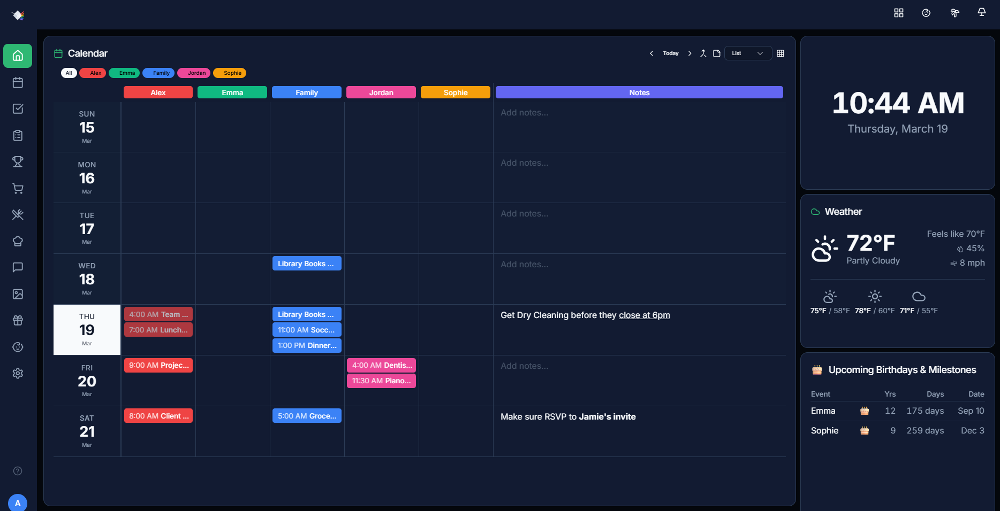
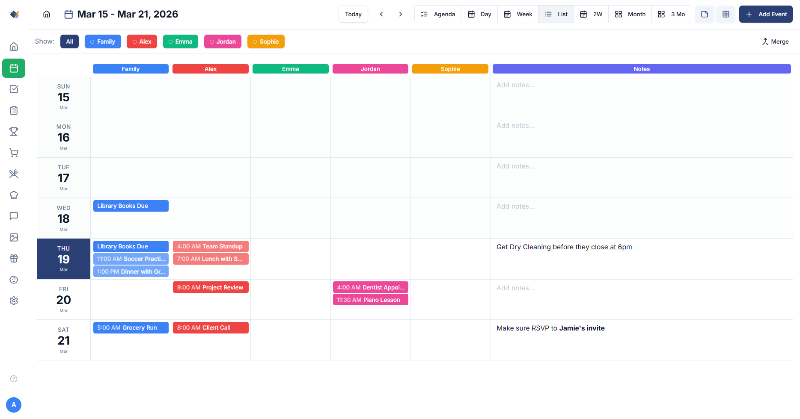
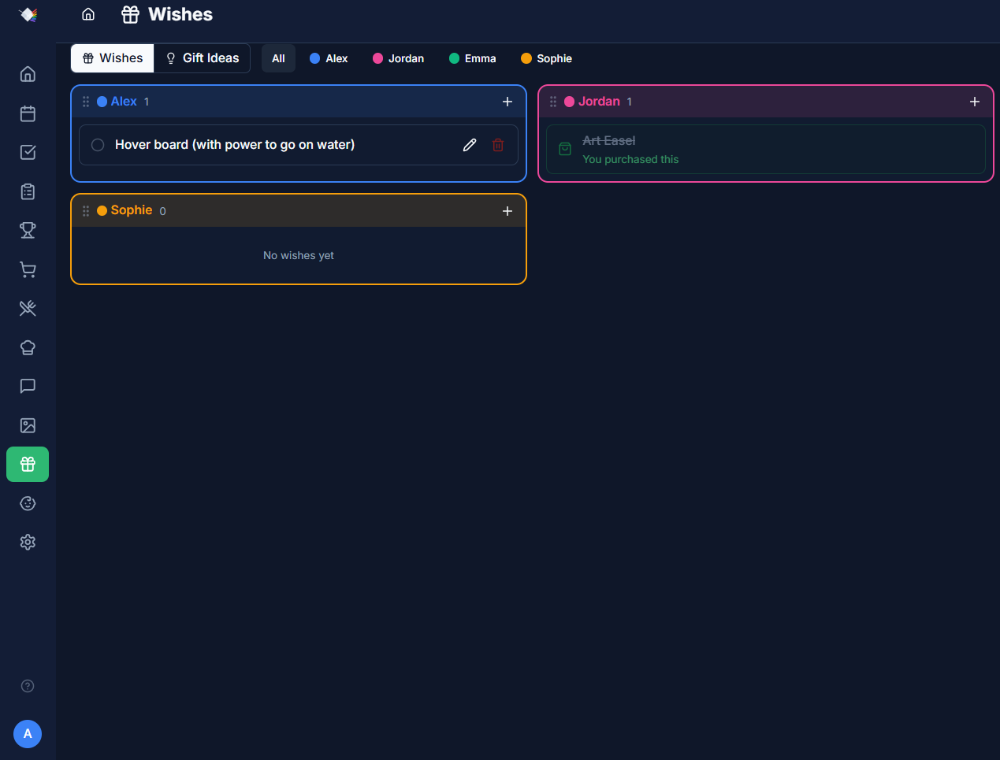
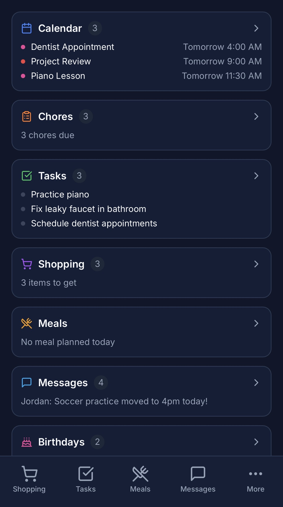

# Prism

**A subscription-free, self-hosted family dashboard that integrates with the tools you already use without becoming yet another system of record.**

[](LICENSE)
[](https://github.com/sandydargoport/prism/actions/workflows/test-install.yml)
[](https://github.com/sandydargoport/prism/pkgs/container/prism)


Prism is a configurable family dashboard designed for large wall-mounted screens and handheld tablets. It connects to existing services you already use - Google Calendar, Microsoft To Do, OneDrive, and more - and displays the information your family actually needs. Built for people who value privacy, hate subscriptions, and are comfortable with Docker.

If Prism is useful to you, a star helps others find it.

---

## Screenshots

<table>
  <tr>
    <td align="center"><b>Dashboard (Dark Mode)</b><br></td>
  </tr>
  <tr>
    <td align="center"><b>Screensaver</b><br></td>
  </tr>
  <tr>
    <td align="center"><b>Calendar</b><br></td>
  </tr>
</table>

<table>
  <tr>
    <td align="center"><b>Chores</b><br></td>
    <td align="center"><b>Shopping</b><br></td>
  </tr>
  <tr>
    <td align="center"><b>Wishes & Gift Ideas</b><br></td>
    <td align="center"><b>Mobile PWA</b><br></td>
  </tr>
</table>

## Getting Started

### Option 1: Clone and build (any platform)

```bash
git clone https://github.com/sandydargoport/prism.git
cd prism
./scripts/install.sh
```

### Option 2: Pull pre-built image (includes Raspberry Pi / ARM64)

```bash
# Download docker-compose.yml and .env.example
curl -O https://raw.githubusercontent.com/sandydargoport/prism/master/docker-compose.yml
curl -O https://raw.githubusercontent.com/sandydargoport/prism/master/.env.example
cp .env.example .env
# Edit .env with your secrets

# Pull and start (auto-selects amd64 or arm64)
docker-compose up -d
```

> **Raspberry Pi**: Tested on Pi 4 (4GB+). Works with the pre-built ARM64 image — no compilation needed.

Open **http://localhost:3000** and log in with PIN `1234` (parent) or `0000` (child).

## What Prism Does

### Dashboard Widgets

Build your home view with drag-and-drop widgets:

- **Calendar** - Day/week/month views syncing with Google Calendar & iCal
- **Weather** - Current conditions and forecasts via OpenWeatherMap
- **Photos** - Rotating family photo slideshow from OneDrive
- **Tasks** - To-do lists with due dates, syncs with Microsoft To Do
- **Shopping** - Grocery lists organized by category with check-off mode
- **Chores** - Assigned chores with points, pending approvals, and completion tracking
- **Meals** - Weekly meal planning grid with recipe linking
- **Messages** - Family message board with pinned and expiring messages
- **Points** - Per-child point totals and goal progress
- **Wishes** - Per-family-member wish lists with Microsoft To Do sync
- **Bus Tracker** - School bus arrival tracking via FirstView email notifications
- **Birthdays** - Upcoming family birthdays
- **Clock** - Simple digital clock with date

Widgets are resizable and rearrangeable on a 48-column CSS Grid. Multiple dashboards are supported (e.g. `/d/kitchen`, `/d/bedroom`), each with independent layouts and screensaver configurations.

### Full-Page Modules

Beyond the dashboard, Prism includes dedicated pages for:

- **Calendar** - Full calendar with multiple view modes (day, week, multi-week, month, 3-month), event creation, and configurable hidden hours
- **Recipes** - Recipe library with URL import (schema.org), Paprika import, and favorites
- **Shopping** - Multiple lists with drag-to-reorder categories and shopping mode
- **Chores** - Chore management with group-by-person view and approval workflow
- **Tasks** - Task lists with Microsoft To Do sync
- **Meals** - Weekly meal planning with recipe linking
- **Goals** - Family goals with point allocation and recurring rewards
- **Wishes** - Per-member wish lists, claim/hide gifts, Microsoft To Do sync
- **Messages** - Family message board with pinned and expiring messages
- **Photos** - Photo gallery with tagging for wallpaper/screensaver use
- **Babysitter** - Public info page for caregivers (emergency contacts, WiFi QR code, house rules)

### Display Modes

- **Screensaver** - Photo slideshow after idle timeout with configurable templates
- **Away Mode** - Privacy screen showing only photos and clock, auto-activates after extended inactivity
- **Babysitter Mode** - Shows caregiver information overlay

### Integrations

- **Google Calendar** - Events (read-only via iCal or OAuth)
- **Microsoft To Do** - Tasks, shopping lists, and wish lists (bidirectional sync)
- **OneDrive** - Photos for slideshow and wallpaper
- **OpenWeatherMap** - Weather data
- **Gmail + FirstView** - School bus arrival tracking via geofence email notifications
- **Paprika** - Recipe import

The goal isn't to replace your existing tools. It's to bring them together in one place that works for your family's rhythms.

## Built for Self-Hosters

Prism is designed for people who:
- Want control over their family's data
- Are comfortable with Docker or basic server setup
- Prefer one-time effort over ongoing subscriptions
- Value privacy and local-first architecture

If you're looking for a plug-and-play commercial solution, Prism might not be for you. But if you're the kind of person who runs a home server or likes tinkering with self-hosted tools, you'll feel right at home.

For remote access outside your home network, consider [Cloudflare Tunnel](https://developers.cloudflare.com/cloudflare-one/connections/connect-networks/) or similar solutions.

## Updating

```bash
cd prism
git pull
docker compose up -d --build
```

Your database, settings, and uploaded files are stored in Docker volumes and are preserved across rebuilds. If an update includes a database migration, it will be noted in the release.

---

> **Everything above is all you need to get started.** The section below is optional background on why and how Prism was built.

<details>
<summary><strong>Behind the Project (click to expand)</strong></summary>

### Why I Built This

I wanted a family dashboard that connected to the tools we already use and didn’t require a monthly subscription. DAKboard is configurable but feels like a solo project that outgrew itself. Skylight is clean but fairly limited. Both offer free tiers that don’t go very far, and the paid versions cost money on an ongoing basis, which I couldn’t get past.

I looked at open-source alternatives like MagicMirror², Homarr, Home Assistant, and many others, but they were all built for somewhat different use cases. Browsing the forums, I found a small group of people who wanted the same thing and had nothing that quite fit.

The integrations reflect the tools my family actually uses — Microsoft To Do for tasks and shopping, Google Calendar for scheduling, OneDrive for photos, OpenWeatherMap for weather. I have limited experience with other ecosystems, so if there’s a service you’d like to see supported, open an issue or submit a PR. I did look into Apple Notes integration since my spouse uses it, but the reverse engineering required more ongoing maintenance than I was willing to take on.

I’m not a software developer, but I work in a technical field where AI tools are increasingly central to how work gets done. I pay for a Claude Code subscription and justify that cost as staying current in my field. I spent around two months on this, from research through testing and iteration. I hope you find it useful. If something is missing or broken, open an issue or submit a PR.

### How It Was Built

This project was built entirely with [Claude Code](https://claude.ai/code). I directed the implementation by defining requirements, designing user experience, prioritizing features, and making product decisions. Claude Code handled the actual coding.

**Competitive research:**
I used Playwright to systematically crawl DAKboard and Skylight, capturing screenshots and analyzing their features, layouts, and interaction patterns. Browser dev tools helped me understand how they handled integrations and real-time updates. This became the foundation for defining what Prism should do differently.

**Code review approach:**
Rather than reviewing code myself - which I’m not well-positioned to do - I used adversarial prompting across multiple LLMs to critique each other’s output. It’s an imperfect process, but it’s more rigorous than a single model reviewing its own work.

**Tech stack:**
- Next.js 15 (App Router) + React + TypeScript frontend
- Node.js backend with PostgreSQL (Drizzle ORM) and Redis caching
- Docker Compose for deployment
- CSS Grid + dnd-kit for dashboard layout (48-column grid)
- PIN-based auth optimized for shared family devices

**On security and code quality:** I’ve done what I can to make this solid - there’s a CI pipeline, E2E tests, and a security policy. I use this in my own home. But I’m not a professional software developer, and I can’t make guarantees I’m not qualified to make. Use reasonable judgment about what you expose to the internet.

### Features I’m Excited About

Some features exist because I needed them:

- **Recipe viewer** - Not another recipe app, but a way to view recipes on a large kitchen screen without repeatedly unlocking my phone
- **Calendar parsing** - Handles the integrations that matter most to families (school calendars, work calendars, shared family events)
- **Drag-and-drop layout** - Build your dashboard the way you want it, resize and arrange widgets to fit your screen
- **Chores with approval workflow** - Kids mark chores complete, parents approve and award points
- **Screensaver modes** - Photo slideshow, away mode for privacy, babysitter mode for caregivers

Some things are still on the roadmap:

- Additional integrations - Google Photos, Todoist, Home Assistant, and other services people actually use
- Multi-household support - For shared custody situations
- Voice control - "Hey Prism, what’s for dinner?"
- Offline support - Service workers so the dashboard works even when internet is down

The architecture makes adding integrations relatively straightforward. If you contribute one that matters to you, we all benefit.

</details>

## Contributing

I built this for my family, but I'm sharing it because others might find it useful. If you do:

- Star the repo
- Report issues you encounter
- Suggest features that would help your family
- Submit PRs for improvements

See [CONTRIBUTING.md](CONTRIBUTING.md) for details.

## License

Prism is free and open-source under the AGPL-3.0 license. It works as a PWA, so the same interface runs on wall-mounted displays, tablets, and mobile devices.

See [LICENSE](LICENSE) for details.

## Acknowledgments

Built with Claude Code. Inspired by frustration with existing solutions. Made better by the self-hosting community.
