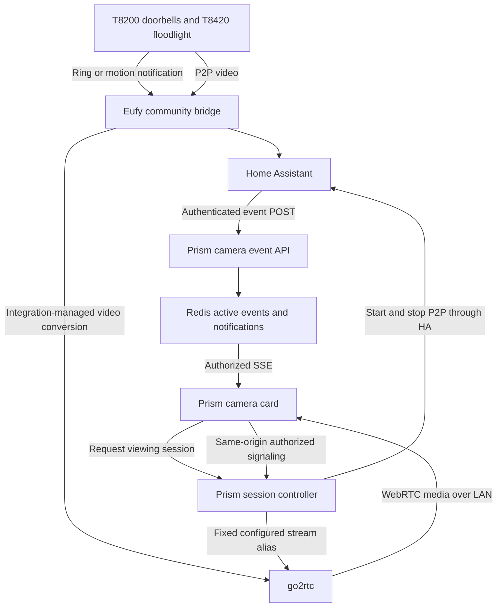

# Proposal and implementation plan: Eufy event camera cards in Prism

Updated September 5, 2026. **Status: proposed implementation; hardware compatibility has not been tested.** This document supersedes the earlier options discussion. Writing it does not install services, change Home Assistant, or deploy Prism.

## 1. Decision and intended result

Use **Home Assistant + the community Eufy Security integration + eufy-security-ws + go2rtc**. Home Assistant delivers camera events to Prism; go2rtc supplies browser-compatible video after the Eufy bridge opens a P2P stream. **Scrypted is excluded from this plan. Frigate is deferred.** Neither is needed to display a card using Eufy's existing ring/motion detection.

The first release targets one enrolled Prism wall display, initially the kitchen, with all three cameras configured and one live camera visible at a time. A ring or motion event opens a floating card, shows an available picture while video connects, and automatically closes after a short interval. The card works over Prism's screensaver, including after normal user idle logout.

There are two separately testable outcomes:

1. **Event cards:** an HA event produces a timely card, with a picture when available.
2. **Live camera cards:** that card also obtains current, moving video reliably enough to be useful.

An event/snapshot-only result is a useful degraded mode, but does not fulfill the requested live-video outcome. Report it explicitly if the hardware trial cannot establish dependable video.

### Hardware findings

| Camera | Confirmed identity | Intended triggers | Video route to trial |
| --- | --- | --- | --- |
| Doorbell 1 | T8200, wired 2K doorbell | Ring and motion | Eufy P2P through the community bridge |
| Doorbell 2 | T8200, wired 2K doorbell | Ring and motion | Same, with its own entity mapping |
| Floodlight | T8420, original hardwired 1080p Floodlight Cam | Motion | Eufy P2P through the community bridge |

Eufy's documentation identifies these models and lists no native NAS/RTSP support for the wired doorbells or original floodlight. An RTSP address created by a bridge is a bridge output, not native RTSP enabled on the camera. [Doorbell identities](https://service.eufy.com/article-description/Compatibility-Between-eufy-Video-Doorbells-and-Chimes), [floodlight identities](https://service.eufy.com/article-description/Differences-Between-eufy-Floodlight-Cameras), [storage compatibility](https://service.eufy.com/article-description/Storage-Methods-Compatibility-for-eufySecurity-Device), [floodlight RTSP limitation](https://service.eufy.com/article-description/Does-Floodlight-Cam-support-RTSP-NAS).

Both models appear in the community library's supported-device list; the T8420 test entry is old. Its source defines ring/motion/person properties for the original wired doorbell and motion/picture properties for the original floodlight. **Do not promise person-only detection on the T8420.** Actual HA entities, current firmware, and event behavior must be discovered. [Supported devices](https://github.com/bropat/eufy-security-client/blob/master/docs/supported_devices.md), [device capabilities](https://github.com/bropat/eufy-security-client/blob/master/src/http/types.ts).

Do not buy a HomeBase for the T8200s: Eufy's compatibility guide excludes them. The guide separately identifies T8420X, so record any actual suffix and existing HomeBase association on the floodlight. Do not assume all three share a HomeBase or a shared-HomeBase concurrency limit. [HomeBase compatibility](https://service.eufy.com/sg/article-description/eufy-Security-Complete-HomeBase-Compatibility-Guide).

### Principal dependency risk

The Eufy library maintainer currently warns that Eufy is retiring legacy APIs. A recent push-notification repair is described as temporary, with a replacement based on Eufy Mega under development. That does not establish a usable replacement today. **Recheck release status and prove both events and live video on one T8200 before committing to the integration path.** [Maintainer notice](https://github.com/bropat/eufy-security-client#eufy-security-client), [WS bridge](https://github.com/bropat/eufy-security-ws).

All three cameras are externally powered. The concerns are stream startup, account/backend compatibility, connectivity, and cleanup. Offline operation is unproven. A recorder cannot recover footage from before an event unless it was already receiving video.

Out of scope: continuous viewing/recording, pre-event replay, Frigate object detection, two-way talk, a permanent grid widget, public remote viewing, new camera hardware, and waking a powered-off display. Keep the existing Eufy app usable.

## 2. Architecture



The event and video paths are independent. Send the event before starting video so a slow camera cannot delay the card. Start a stream only when an authorized display requests it. Prism handles event policy, authorization, and lifecycle; it does not decode video in a Next.js route.

Use the go2rtc instance managed/configured for the HA Eufy integration. Discover its actual stream aliases and lifetime behavior after starting P2P. Do not add a second competing Eufy controller or guess permanent RTSP URLs from camera IDs. Follow the integration's own setup and video flow. [HA Eufy integration](https://github.com/fuatakgun/eufy_security).

### Network and codec requirements

- HA must reach Prism's event endpoint; Prism must reach HA and go2rtc; the wall browser must reach go2rtc's advertised WebRTC media address.
- Proxy snapshots and signaling through Prism's origin. Keep upstream credentials and source URLs on the server. WebRTC SDP necessarily reveals negotiated network candidates to the browser.
- WebRTC media travels separately from HTTP signaling. Validate a reachable LAN candidate and the configured media port; go2rtc defaults to TCP/UDP 8555. A working HTTPS reverse proxy does not prove the media path works. Do not copy Docker-only addresses into browser candidates. [go2rtc networking](https://github.com/AlexxIT/go2rtc/blob/master/internal/webrtc/README.md).
- Restrict go2rtc's administrative HTTP API and RTSP listener to the required services. Its defaults are not an authentication boundary. Do not expose its general API, stream creation, or executable source options through Prism. [go2rtc security](https://github.com/AlexxIT/go2rtc#security).
- Prefer H.264 passthrough when available. Measure the actual P2P codec/resolution. Add FFmpeg conversion inside the media service only if an observed codec mismatch requires it. Do not assume a 2K camera delivers a 2K third-party stream. [go2rtc capabilities](https://github.com/AlexxIT/go2rtc).
- Use existing host capacity for the trial. Verify the kitchen browser and production HTTPS/network path. Do not introduce public port forwarding or TURN infrastructure for this LAN feature.

WebRTC is the first-release transport. If it cannot work on the target browser/network, document that failure and propose a separately tested authenticated MSE/HLS adapter. Do not silently expand the implementation to several transports.

## 3. User-visible behavior and defaults

These are proposed product decisions, not claims about measured Eufy performance.

| Situation | Required behavior |
| --- | --- |
| Doorbell ring | Open the corresponding card immediately; default visibility 60 seconds. |
| Motion | Open the corresponding card for 30 seconds. |
| Initial video connection | Show camera name, event reason/time, and “Connecting”; display an available picture. |
| Playback | Mark “Live” only after decoded video frames arrive. Autoplay muted with `playsInline`; tap to unmute if audio works. |
| Video failure | After at most 15 seconds, show “Live video unavailable,” available picture, and Retry. A text-only event card is valid when no image exists. |
| Snapshot freshness | Use the source capture time when known. Otherwise say “Latest available image — capture time unknown.” Never use event receipt time as image capture time. |
| Duplicate delivery | The same event ID never opens another card or extends its timer. |
| Fresh repeated motion | Coalesce per camera within a 10-second cooldown; update last activity and extend expiry without restarting playback. |
| Fresh repeated ring | Bypass motion cooldown; extend/promote the existing card. Never suppress a distinct ring merely because a motion card is open. |
| Multiple cameras | Rings outrank motion; the newest ring wins between doorbells. Show other unexpired cameras as selectable tabs. Only the selected camera streams on this display. |
| Dismiss | Close the current camera card and release its viewer. Do not reopen it from the same event during reconnect; a new ring may open it again. |
| Keep open | Extend viewing up to a hard five-minute session limit; show an explicit action to begin another session afterward. |
| Repeated automatic activity | Limit a continuous automatic card episode to two minutes. New activity during that episode cannot keep it open indefinitely. |

After an automatic episode ends, apply a 10-second motion reopen cooldown. A genuinely new ring may begin a new episode immediately. Server-computed expiry times are authoritative. A refresh must not reset an episode or extend a viewer's hard lifetime.

The card should appear above the screensaver without toggling idle, Away, or Babysitter settings. Initially suppress it in Away mode and during PIN entry/settings; allow it during Babysitter mode on the explicitly enrolled family display. Release the viewer when suppressed. On return, show only events still within their original expiry. Expose a simple enable/disable setting per target display.

Use a compact floating card with Dismiss, Keep open, Retry when needed, and other-camera tabs. Preserve radar/media-player controls and usable touch targets in portrait and landscape. Do not mount solely inside the existing desktop-only dashboard card stack.

## 4. Repository discovery and allowed APIs

This section records inspected repository patterns. Read the named symbols again before editing because the checkout may have advanced. All camera-specific files and endpoints in later sections are **proposed additions**, not APIs that already exist.

| Existing source | Pattern to use and boundary |
| --- | --- |
| [`homeAssistantCredentials.ts`](../src/lib/integrations/homeAssistantCredentials.ts) | Copy encrypted `apiCredentials` storage and `homeAssistantFetch(config, path, init)` usage. Existing `validateConfig` requires a media player; `validateEntity` only accepts media-player/remote domains. Add independent camera config under `home-assistant-cameras`; do not require or overwrite Apple TV setup. |
| [`HA config route`](../src/app/api/integrations/home-assistant/config/route.ts) | Copy `requireAuth()` then `requireRole(auth, 'canModifySettings')`, input validation, and server-side connection testing. Preserve permission checks for scoped API tokens. |
| [`HA provider card`](../src/app/settings/sections/integrations/cards/HomeAssistantMediaPlayerProviderCard.tsx) | Copy settings form/status conventions; add a separate camera card. Return a redacted config/status response. |
| [`requireAuth.ts`](../src/lib/auth/requireAuth.ts) | `getDisplayAuth()` can return a configured guest without a browser credential. It is insufficient for camera viewing. Retain existing PIN/session behavior. |
| [`safeFetch.ts`](../src/lib/utils/safeFetch.ts) | Use `validatePublicUrl` and `safeFetch(rawUrl, init, options)` for upstream requests. Configure exact HA/go2rtc hosts in `PRISM_ALLOWED_INTERNAL_HOSTS`; retain redirect validation. |
| [`getRedisClient.ts`](../src/lib/cache/getRedisClient.ts) | Reuse the existing `redis` client factory. It returns `RedisClientType` or `null`; camera events/sessions must return 503 when durable coordination is unavailable. |
| [`schema.ts`](../src/lib/db/schema.ts), [`crypto.ts`](../src/lib/utils/crypto.ts) | Existing encrypted integration storage and Drizzle migration patterns. Make minimal additive schema changes for camera access grants and cleanup records. |
| [`FloatingCardStack.tsx`](../src/components/dashboard/FloatingCardStack.tsx), [`MediaPlayerPlaybackCard.tsx`](../src/components/widgets/MediaPlayerPlaybackCard.tsx) | Copy visual/layout conventions, including auto-hide interaction handling. Existing stack is at z-index 10000 and rendered conditionally by the desktop dashboard. |
| [`LazyOverlays.tsx`](../src/components/layout/LazyOverlays.tsx), [`Screensaver.tsx`](../src/components/screensaver/Screensaver.tsx), [`root layout`](../src/app/layout.tsx) | Root-level place for a lazy camera alert provider/overlay with explicit route/mode policy. Screensaver uses z-index 9999; coordinate layers rather than raising every overlay. |
| [`useIdleLogout.ts`](../src/lib/hooks/useIdleLogout.ts) | User selection is cleared on idle. Do not disable logout to keep camera cards functioning. |
| [`instrumentation.ts`](../src/instrumentation.ts), [`calendarSyncCron.ts`](../src/lib/server/calendarSyncCron.ts) | Copy lazy Node-only worker registration. Add camera-specific process idempotency and distributed coordination; existing cron registration alone does not supply them. |
| [`middleware.ts`](../src/middleware.ts), [`securityHeaders.js`](../src/lib/utils/securityHeaders.js), [`next.config.js`](../next.config.js) | HA requests without Origin already rely on endpoint authentication. No blanket CSRF exemption is needed. Keep CSP narrow and camera responses out of caches. |
| [`playwright.config.ts`](../playwright.config.ts), [`package.json`](../package.json) | Actual development/E2E port is 3005. Use repository scripts and existing auth/test helpers. |

### Verified upstream API surface

| API | Allowed use and source |
| --- | --- |
| HA `GET /api/states`, `GET /api/services` | Discover actual entity IDs and registered actions server-side; retain only needed fields. [HA REST API](https://developers.home-assistant.io/docs/api/rest/) |
| HA `POST /api/services/{domain}/{service}` | Call a verified action with JSON `entity_id`. Do not invent a stream URL endpoint. [HA REST API](https://developers.home-assistant.io/docs/api/rest/) |
| Eufy HA `eufy_security.start_p2p_livestream` / `stop_p2p_livestream` | The integration registers these entity services in `camera.py`; verify they exist in the installed HA registry before using them. Its `camera.turn_on`/`turn_off` methods also dispatch according to stream provider. Choose one tested action pair. [Camera implementation](https://github.com/fuatakgun/eufy_security/blob/master/custom_components/eufy_security/camera.py), [service definitions](https://github.com/fuatakgun/eufy_security/blob/master/custom_components/eufy_security/services.yaml) |
| HA `rest_command` | Send templated JSON with an Authorization header; serialize with `to_json`. Use response status for bounded retries. [RESTful Command](https://www.home-assistant.io/integrations/rest_command/) |
| HA state/event triggers | Copy the documented syntax after identifying the actual trigger source. A state held at `on` does not establish one event per physical press. [Automation triggers](https://www.home-assistant.io/docs/automation/trigger/) |
| go2rtc `POST /api/webrtc?src=<configured-alias>` | Current `syncHandler`/`outputWebRTC` accepts JSON `{type:"offer",sdp:...}` and returns an answer in the same shape. Use this bounded HTTP exchange initially. [Signaling source](https://github.com/AlexxIT/go2rtc/blob/master/internal/webrtc/server.go) |

For the HTTP signaling adapter, gather browser ICE candidates before sending the offer; use a bounded non-trickle exchange. The inspected go2rtc source rejects PATCH. Its playback response does not supply the ingest session's `Location`/DELETE lifecycle. **Do not invent a viewer DELETE endpoint by copying WHIP ingest behavior.** Recheck the installed release and record the exact tested protocol. Close the browser peer on release and separately stop owned P2P when no authorized viewers remain.

## 5. Configuration, authorization, and data contracts

### Camera configuration

Keep credentials encrypted on the server. Store independent HA URL/token and go2rtc URL/auth plus three validated camera mappings. Each mapping contains:

- Stable Prism ID (`doorbell-1`, `doorbell-2`, `floodlight-1`), editable friendly name, enabled flag.
- HA camera entity ID, verified ring/motion source IDs and trigger semantics, available picture source.
- Integration-managed go2rtc alias or documented resolver for its lifetime; verified start/stop action pair.
- Allowed event kinds, target display ID, and capability results: events, picture, live video, audio.

Reject arbitrary source URLs supplied to runtime endpoints. The browser sees opaque camera/session IDs, friendly names, event data, and an SDP answer, not HA tokens or upstream stream URLs. Settings connection tests are explicit; ordinary status checks do not start cameras repeatedly.

### Narrow access grants

Add a camera-specific access-grant table/service with an ID, cryptographic token hash, kind (`event-ingress` or `display`), allowed camera IDs, display binding where applicable, created/expiry/revoked timestamps, and creator. Generate at least 32 random bytes; persist only the token hash. Default display enrollment lasts 90 days and is revocable from settings. Use existing crypto/token patterns, but do not give these grants general Prism API permissions.

The HA grant accepts only event POSTs for its configured cameras. Generate/rotate it in settings and show its raw value once for HA secrets. It cannot read images or start streams.

Enroll the current wall browser through a settings-authorized session. Set a dedicated HttpOnly, SameSite=Strict cookie; use Secure for production HTTPS, with an explicitly local development exception. The display grant survives ordinary user idle logout and allows only its assigned camera features. It cannot modify settings. No token in localStorage or query strings. Enrollment endpoints require same-origin browser session authorization, not just a guest display identity.

All SSE, snapshot, session, and signaling requests check camera/display scope and revocation. Recheck on heartbeats. A browser claiming a display ID or dashboard slug is not authentication. Do not allow unrelated scoped API tokens to inherit camera permissions from a parent role.

### New Prism endpoints

Route names below are the implementation contract; adapt a name only if a repository convention requires it and update this document with the code.

| Endpoint | Purpose and authorization |
| --- | --- |
| `GET/POST/DELETE /api/cameras/config` | Redacted config, save, disable; settings permission. Disable releases viewers and starts cleanup before removing upstream details. |
| `POST /api/cameras/discover` | Bounded HA discovery using supplied/saved credentials; settings permission. |
| `GET /api/cameras/health` | Redacted component/camera status and last success/failure; settings permission. |
| `POST /api/cameras/ingress-token` | Create/rotate the event grant; settings permission. |
| `GET/POST/DELETE /api/cameras/displays` | List, enroll current browser, revoke by grant ID; settings session permission. |
| `POST /api/cameras/events` | Validate/store an HA event; dedicated ingress grant only. |
| `GET /api/cameras/events/stream` | SSE snapshot plus subsequent changes; authorized display only. |
| `GET /api/cameras/active` | Current unexpired event snapshot/revision for recovery; authorized display only. |
| `GET /api/cameras/[cameraId]/snapshot` | Bounded, authenticated image proxy with honest freshness metadata. |
| `POST /api/cameras/[cameraId]/sessions` | Acquire viewer lease; returns opaque session ID, state, and server deadlines. |
| `PATCH/DELETE /api/cameras/sessions/[sessionId]` | Renew within hard deadline, or idempotently release; owning display grant only. |
| `POST /api/cameras/sessions/[sessionId]/webrtc` | Validated SDP exchange to this session's configured alias only. |

Return 401/403 for missing/insufficient credentials, 400 for invalid input, 429 for limits, and 503 for unavailable coordination. Avoid leaking upstream response bodies. Use Node runtime, bounded request sizes/timeouts, and `Cache-Control: private, no-store` on private camera responses. Do not put camera images, tokens, SDP, or upstream URLs in telemetry. Disabling immediately prevents new viewers; retain the encrypted upstream configuration until outstanding owned-stream cleanup finishes, then finalize deletion.

### Event envelope

```json
{
  "version": 1,
  "eventId": "unique-source-event-id-retained-across-retries",
  "cameraId": "doorbell-1",
  "kind": "doorbell",
  "occurredAt": "2026-09-05T18:30:00.000Z"
}
```

This is a schema example, not a live request. `kind` is initially `doorbell` or `motion`. `occurredAt` is the source event time when available, otherwise HA's observation time; document which. Add server `receivedAt` separately. Never include a video URL, secret, or caller-selected HA entity in an event.

Implementation defaults: maximum body 4 KiB; reject unknown cameras/kinds and unsupported versions; reject events over 60 seconds old or over 10 seconds in the future. Keep hosts time-synchronized. Dedupe `(ingress identity, eventId)` for 30 minutes; store a payload digest and reject conflicting reuse of an ID. A duplicate receives success with `duplicate: true` and cannot extend expiry. Configure a bounded ingress rate limit that comfortably permits both doorbells plus motion bursts.

Use an atomic Redis operation to validate dedupe state, update active-event state/revision, and publish the change. Do not mark dedupe success before the active record is committed. A fresh event returns 202 only after storage succeeds. Redis failure returns 503 so HA can retry.

SSE uses short-lived active state, not an event-history product. Subscribe before reading the current snapshot, buffer concurrent updates, and reconcile by revision. On reconnect or revision gap, replace state from a snapshot; `Last-Event-ID` alone cannot recover Redis Pub/Sub history. Send a heartbeat every 15 seconds, disable proxy buffering, clean up subscriptions on disconnect, and remove expired events using server deadlines. Publish only fields authorized for that display.

## 6. Stream ownership and failure behavior

Implement a server-side camera adapter with operations for capabilities/status, snapshot, acquire/start, and release/stop. Eufy-specific behavior stays inside its HA adapter. UI and event policy depend only on Prism camera IDs.

Viewer leases renew every 15 seconds, expire after 45 seconds without a heartbeat, and have a five-minute absolute lifetime. Renewing cannot move the absolute deadline. Keep open and card expiry control a viewer lease separately from the camera's shared upstream stream. Acquisition returns an opaque session promptly; the signaling request may await its shared start attempt within the same 15-second initial connection budget. Do not stack separate 15-second waits for startup and signaling. Heartbeat responses report session state and deadlines.

For each camera, serialize start/stop transitions with a Redis lock and generation/fencing checks. Multiple tabs may share one upstream P2P stream; one tab closing must not stop another active viewer. Handle acquire-during-stop and release-during-start explicitly. A timed-out start may complete upstream later, so retain cleanup responsibility until that generation is reconciled. Never create a new unmanaged P2P start on every heartbeat.

Record cleanup responsibility durably in Postgres **before** requesting an owned start. Include the camera mapping needed to stop it, generation, hard deadline, and cleanup state; no raw tokens. Run a camera cleanup worker every 10 seconds through Node instrumentation, with process idempotency and distributed ownership. Use leases to decide when to stop; preserve failed cleanup records for retry. On restart, reconcile them before new starts. Do not rely on in-process request timers, browser unload, or Redis expiry notifications alone.

If a stream was already running before Prism requested it, do not assume ownership or stop another consumer's session. Test coexistence with the Eufy app and other HA viewers. The integration may not expose perfect ownership: document actual behavior, and use one controller plus conservative cleanup rules rather than claiming isolation that the bridge cannot provide.

Require an independent upstream lifetime backstop for Prism-owned starts: either a verified bridge timeout or an HA watchdog. If implementing the watchdog, persist the owned-start deadline, stop on deadline, and reconcile on HA startup. A timer alone is insufficient when it expires while HA is down. Copy supported timer/helper syntax and test restart behavior. [HA timer documentation](https://www.home-assistant.io/integrations/timer/).

A stopped/failed Prism process cannot guarantee immediate cleanup of an unreachable camera. Report pending cleanup and recover when connectivity returns. Likewise, denying further signaling does not revoke already negotiated WebRTC media by itself: the inspected HTTP API does not establish individual viewer termination. For the first display, close the peer and stop its owned upstream when its last viewer expires. Where another viewer keeps the source alive, disclose the remaining revocation limitation; do not promise instantaneous media cutoff without verifying a per-peer termination API.

Playback state is based on decoded frames, using video frame callbacks or a tested decoded-frame counter. A connected peer or HA “streaming” state is not enough. If frames stop progressing for five seconds, leave “Live,” offer Retry, and release the failed attempt. Bound automatic retry to one attempt within the existing lifetime; repeated failures must not spin start/stop indefinitely.

Snapshot requests must use only the configured HA entity/picture source, authenticated upstream fetch, exact allowed origins, bounded size (initially 5 MiB), supported image content types, and a timeout. Do not blindly forward arbitrary `entity_picture` URLs or embed HA camera-token URLs. Do not write snapshots to persistent storage by default.

## 7. Phased execution plan

Each phase ends with an evidence note: files changed, exact versions/APIs used, checks run, result, remaining gaps, and the next phase. Use `docs/eufy-camera-validation.md` for sanitized observations and a short handoff between agent sessions. Missing hardware access permits mock-backed independent development, but must remain an explicit integration blocker.

### Phase 0 — Refresh documentation and establish the baseline

**Tasks:** Read sections 1–6 and every local pattern relevant to the next phase. Check current Eufy integration, bridge, library, and go2rtc release notices. Record chosen versions and commit/release links in the validation document. Confirm installed API signatures against the allowed-API table. Inspect the working tree before editing; use the repository's personal-work workflow and preserve existing modifications.

**Outputs:** Version matrix, repository baseline, verified external API list, actual deployment topology, and a list of unknown values to discover in Phase 1. No camera feature code yet.

**Verify:** Every external operation has an official/maintainer source or installed service-registry entry. Identify the real kitchen browser, Prism origin, HA installation type, and where the media service runs from available configuration. Never copy secrets into the report.

**Guards:** Do not use an old supported-device checkmark as present-day proof; do not invent Eufy event names, an RTSP URL, or a ready Mega replacement. Do not reset unrelated local changes.

### Phase 1 — Prove the HA/Eufy/go2rtc path on real hardware

**Tasks, in order:**

1. Inventory all three cameras, firmware, floodlight suffix/association, and existing HACS/Eufy/go2rtc installations. Follow the [Eufy integration setup](https://github.com/fuatakgun/eufy_security) and [WS add-on documentation](https://github.com/bropat/hassio-eufy-security-ws).
2. For HA OS, use the supported add-on installation path; for HA Container, use the documented separate service/container path. Persist bridge authentication state. Use service DNS/host addresses appropriate to the actual network; `127.0.0.1` is not another container.
3. Follow the integration's account-sharing instructions with a dedicated Eufy account, correct region, and required shared-device permissions. Complete attended MFA/CAPTCHA where required. Enable ring/motion notifications needed for event delivery. Do not log passwords or session tokens.
4. Start with the more frequently used T8200. Discover its HA camera, ringing, motion, and picture sources. Confirm actual start/stop actions using `/api/services`. Test a real button press and physical motion independently.
5. Specifically press twice while the first ringing state remains active. If only an off-to-on binary-sensor transition exists, identify whether the installed integration exposes a distinct event for each press. If it does not, record that limitation; changing Prism dedupe cannot restore an event HA never received.
6. Start P2P, identify the integration-managed go2rtc alias, and play video in the actual kitchen browser/network. Measure cold-start time, codec, first decoded frame, and explicit stop. Then repeat for the second doorbell and floodlight.
7. Test coexistence with Eufy app viewing, more than one browser tab, a camera switch, and source idle/restart. Establish who owns starting/stopping and how long streams can run.

**Outputs:** A completed three-camera capability table with entity/action/alias mappings, sanitized example events, measured startup/cleanup, and an explicit usable/blocked result per capability.

**Verify:** At least five cold-start ring/video trials on the first T8200 and a successful event/video/stop trial on each remaining camera before full integration. Confirm browser media connectivity, not just a go2rtc status page. Expanded reliability testing belongs in Phase 6.

**Guards:** If authentication/backend migration blocks the path, document the failing layer and stop claiming live compatibility. Continue independent mockable work only as such. Do not install Scrypted or Frigate as an automatic fallback.

### Phase 2 — Add camera configuration and access control

**Tasks:** Implement `src/lib/integrations/homeAssistantCameraCredentials.ts`, `src/lib/cameras/config.ts`, and `src/lib/cameras/auth.ts` using the inspected storage/auth patterns. Add the settings card and config/discovery/grant routes. Add minimal Drizzle migrations for camera access grants and durable stream cleanup records. Reuse the server HA fetch helper without changing media-player configuration semantics.

Provide settings controls to enable the feature, map discovered entities, enroll this display, rotate ingress credentials, revoke enrollment, and inspect redacted health. Keep runtime secrets server-side. Default the feature to disabled until mappings and enrollment exist.

**References:** Local credentials/config/provider-card/auth/schema/safeFetch files in section 4; HA REST API discovery documentation.

**Verify:** Round-trip encrypted config, no media-player setup regression, invalid entities/URLs rejected, wrong-scope and guest access denied, grants expire/revoke, tokens absent from redacted responses. Generate/review migrations and run them only against the development database during development.

**Guards:** No anonymous access based on `displayUserId`; no wildcard HA ingress token; no hardcoded LAN addresses; no broad SSRF or CSP exception; no `db:push` against production.

### Phase 3 — Build event delivery and the HA automation package

**Tasks:** Implement `src/lib/cameras/events.ts`, Redis storage/dedupe/revisions, the ingress route, active snapshot route, and SSE stream. Add a deterministic event reducer for priority/expiry/coalescing. Use a dedicated Redis subscriber connection through the existing client setup; do not switch the shared command connection into subscriber-only use.

Create `docs/home-assistant/prism-camera-events.yaml` and installation instructions after discovering real triggers. The package must define a shared `rest_command`, a sender script, and these mappings:

| Actual source | Prism camera ID | Kind |
| --- | --- | --- |
| Doorbell 1 verified ring source | `doorbell-1` | `doorbell` |
| Doorbell 1 motion source | `doorbell-1` | `motion` |
| Doorbell 2 verified ring source | `doorbell-2` | `doorbell` |
| Doorbell 2 motion source | `doorbell-2` | `motion` |
| Floodlight motion source | `floodlight-1` | `motion` |

Use `!secret` for the Prism URL/Authorization value. Serialize the section 5 envelope with `to_json`. Create event ID and occurrence time once per trigger, before calling the sender; retain them across retries. Use a verified source event ID or a generated unique ID per automation run. Trigger only actual activity transitions, not initial `unknown`/`unavailable` recovery. Permit parallel sender runs so motion cannot block a doorbell.

Retry network errors, 429, or 5xx at most twice, with 1-second and 3-second waits and bounded per-request timeout. Do not retry malformed/unauthorized requests indefinitely. Capture response status with `response_variable` and handle transport exceptions as failures. The sender never waits for live-stream startup. Validate the completed YAML with HA before enabling it.

**References:** [RESTful Command](https://www.home-assistant.io/integrations/rest_command/), [automation triggers](https://www.home-assistant.io/docs/automation/trigger/), existing Redis factory and middleware.

**Verify:** Real disposable Redis tests for simultaneous duplicate POSTs, conflicting IDs, publish/snapshot races, expiry, reconnect, and store failure. Verify stale/future input, camera scopes, ring priority, and no duplicate timeout extension. Confirm a real HA trigger reaches an enrolled test display without opening a stream yet.

**Guards:** No five-second polling for short ring events; no process-local event bus as the authoritative store; no replay of expired events after reconnect; no fake second-ring support.

### Phase 4 — Add bounded viewing sessions and video

**Tasks:** Implement `src/lib/cameras/sessions.ts`, `src/lib/cameras/providers/homeAssistant.ts`, `src/lib/cameras/go2rtc.ts`, snapshot/session/signaling routes, and `src/lib/server/cameraSessionCleanup.ts`. Register the cleanup worker from instrumentation. Implement the lease, ownership, generation, and durable cleanup rules in section 6. Configure/test the upstream watchdog.

Build `src/components/cameras/CameraVideoPlayer.tsx` using native `RTCPeerConnection`: receive-only tracks, bounded ICE gathering, authorized same-origin JSON SDP exchange, frame-based playback state, and explicit peer closure. Bound SDP size (initially 128 KiB) and handshake time. Proxy only the server-resolved `src` alias and fixed method. Implement snapshot fallback independently of video success.

**References:** Eufy `camera.py`/`services.yaml`, go2rtc `server.go`/WebRTC README, local fetch/worker patterns, [HA timer documentation](https://www.home-assistant.io/integrations/timer/).

**Verify:** Start once for concurrent viewers; closing one preserves another; last viewer release/expiry stops an owned stream; acquire/stop races do not orphan a start. Exercise tab crash, lost network, Redis restart, Prism restart, HA restart, delayed start completion, failed stop, grant revocation, and hard deadline. On the real display, prove first moving frame and stalled-video fallback.

**Guards:** No guessed go2rtc playback DELETE API, no unchecked stream/source query parameter, no direct public RTSP/HA tokens, no unbounded retry, no “Live” label inferred from connection state alone.

### Phase 5 — Integrate the floating card across display states

**Tasks:** Add `src/components/cameras/CameraAlertProvider.tsx`, `CameraEventCard.tsx`, and `src/lib/hooks/useCameraEvents.ts`. Mount lazily through the root overlay path. Apply section 3 timing/priority/mode behavior. Coordinate placement with existing floating cards and release sessions when switching tabs, dismissing, navigating to suppressed routes, or entering Away mode.

Persist dismissed event IDs per display browser in session storage, scoped to grant ID and event expiry, so an SSE reconnect or refresh does not reopen the same event. Store no credential or image there. A new event ID remains eligible. Clear state on enrollment changes.

**References:** Root layout, LazyOverlays, Screensaver, FloatingCardStack, MediaPlayerPlaybackCard, idle logout hook, security headers.

**Verify:** Component tests for priority, competing cameras, dismissal, timer caps, unknown image time, and inaccessible video. Playwright coverage at portrait/landscape sizes, including screensaver, normal idle logout, Away/Babysitter, PIN/settings, and coexistence with radar/media controls. Camera alerts must not change the active user or mode settings.

**Guards:** No desktop-only mount; no hidden second live player for thumbnails; no unmuted autoplay assumption; no camera content above PIN entry; no reset of server expiry after rerender/reconnect.

### Phase 6 — Validate, document, and prepare the release

**Tasks:** Audit implementation against the verified upstream versions/APIs, run relevant repository checks, complete the real-device matrix below, and write the operational runbook. Include setup locations, network requirements, secrets rotation, enrollment renewal, service restart recovery, health interpretation, feature-disable/cleanup, and removal/rollback steps.

Use the existing scripts: `npm run type-check`, `npm run lint`, `npm run build`, focused Jest suites for camera behavior and affected HA/auth regressions, then `npx playwright test e2e/camera-alerts.spec.ts` after creating that test. The configured app/E2E port is 3005. Record baseline/unrelated failures honestly rather than broadening this feature to repair unrelated work.

Search camera paths for forbidden patterns: `getDisplayAuth` as sole authorization, `localStorage` credentials, `dangerouslySetInnerHTML`, unchecked source URLs, broad `Access-Control-Allow-Origin`, public caching, unbounded retry loops, and implicit timer-only cleanup. Inspect findings rather than treating text matches as conclusive tests.

Run the app, capture fresh screenshots of the actual affected UI, and attach them to the implementation handoff as required by AGENTS.md. Include a real authorized live view and a failure/snapshot state when hardware is available; label mock media clearly. Do not expose private footage in public artifacts.

Update `PERSONAL.md` when the implementation becomes a personal feature, using its required numbered inventory and real contributing commit hash. Follow the repository's personal branch workflow. This proposal itself authorizes no production deployment; use the applicable kitchen staging/promotion workflow when deployment is requested.

**Outputs:** Implementation and migrations; validated HA package; sanitized capability/measurement report; operator runbook; meaningful tests; UI screenshots; explicit remaining limitations. A tested staging candidate may be prepared within the subsequently assigned implementation scope.

**Guards:** No “complete” claim based only on mocks, a stream status API, or one successful ring. No production migration/deploy inferred from finishing this document.

## 8. Acceptance criteria and measurement

Suggested timing targets are goals to measure, not guarantees from Eufy or this proposal.

| Area | Acceptance evidence |
| --- | --- |
| Ring delivery | At least 20 physical presses per T8200, including rapid repeated presses; every observed supported source event maps to the correct card, with any missing physical presses reported separately. |
| Motion delivery | At least 20 physical motion trials per camera; record device detection misses separately from HA/Prism delivery misses. |
| Event latency | Aim for HA/Prism event receipt to rendered card under one second on the LAN; measure physical action to HA separately. |
| Video startup | Record success rate, median, p95, and maximum physical action to first decoded frame. Aim for about five seconds; fallback appears by 15 seconds. A slow result is reported as slow. |
| Image correctness | Cached/unknown-time picture never presented as current event footage or live video. |
| Arbitration | Both doorbells plus floodlight activity choose the expected card; one live feed per display; selecting another releases the previous viewer. |
| Cleanup | Normal last-viewer release stops an owned stream promptly, target within 10 seconds; abandoned viewer expires within 45 seconds plus worker cadence, subject to measured upstream stop time. Restart/watchdog recovery is demonstrated. |
| Authentication | Unenrolled browser, guest fallback, wrong-camera grant, revoked grant, and ingress token cannot read private camera media. Already-established media revocation limits are documented. |
| Display continuity | Screensaver and idle logout do not prevent authorized alerts; PIN/settings and Away policy are preserved; normal dashboard use remains functional. |
| Resilience | HA/bridge/go2rtc/Redis/Prism and browser restarts produce recovery or a clear unavailable state, without stale alerts or unmanaged stream starts. |

Use a validation table with camera, firmware, action, physical time, HA observation, Prism receipt, card visible, snapshot capture time if known, first decoded frame, stop completion, and outcome. Redact images, tokens, account data, and network addresses from shareable reports. Perform night-mode tests and several cold starts after long idle. Test Internet loss separately for existing playback and new events/stream startup; report observed behavior.

After the controlled trials, observe ordinary operation for several days and record missed rings, nuisance motion, startup delays, and stuck sessions. Do not keep streams continuously open merely to make cold-start measurements look better. If visitors commonly leave before video appears, the live feature has not met its purpose even if playback eventually connects.

## 9. Failure decisions and estimated effort

| Finding | Next action |
| --- | --- |
| Events work, video fails | Ship no live-video claim. Keep a clearly labeled event/snapshot prototype and identify the failed P2P/codec/network layer. |
| Video works, ring events fail | Record ring-triggered behavior as blocked. Motion video does not substitute for detecting the button press. |
| Repeated presses collapse in HA | Document the physical-button limitation and investigate only APIs actually exposed by the integration. |
| Eufy migration blocks the bridge | Record versions and evidence; revisit the maintained replacement when usable. Keep the Prism adapter boundary. |
| Browser cannot reach WebRTC media | Fix LAN candidates/routing before adding another platform. If that is impossible, propose a measured transport alternative separately. |
| T8420 motion is noisy | Tune the camera's supported sensitivity/zones first. Person detection/Frigate remains a separate project requiring a dependable input stream. |

Budget roughly half a day to two days for initial compatibility work, then approximately five to ten engineering days for the bounded sessions, access control, HA package, UI, tests, and runbook, plus several days of observation. These are planning ranges; Eufy backend failures can block completion irrespective of coding time. Start with existing hardware. No Scrypted, Frigate, NVR subscription, HomeBase purchase, or new camera is required by this proposal.

## 10. Starting instruction for the implementation agent

> Implement the Eufy event camera card feature described in `docs/eufy-camera-event-proposal.md`, starting with Phase 0 and the real-device compatibility gate. The inventory is two T8200 wired doorbells and one T8420 floodlight. Use Home Assistant, the community Eufy bridge, and go2rtc; exclude Scrypted and Frigate. Preserve existing Prism personal features and unrelated working-tree changes. Record actual entities, versions, measured behavior, and remaining gaps in `docs/eufy-camera-validation.md`. Keep events independent from stream startup, enforce viewing authorization and bounded cleanup, and validate the card on the actual wall browser. Complete each phase's verification before reporting it finished. If hardware access or the Eufy backend blocks validation, continue only independent work and distinguish the tested prototype from a functioning live integration. Follow the repository's screenshot and release procedures when they become applicable.
